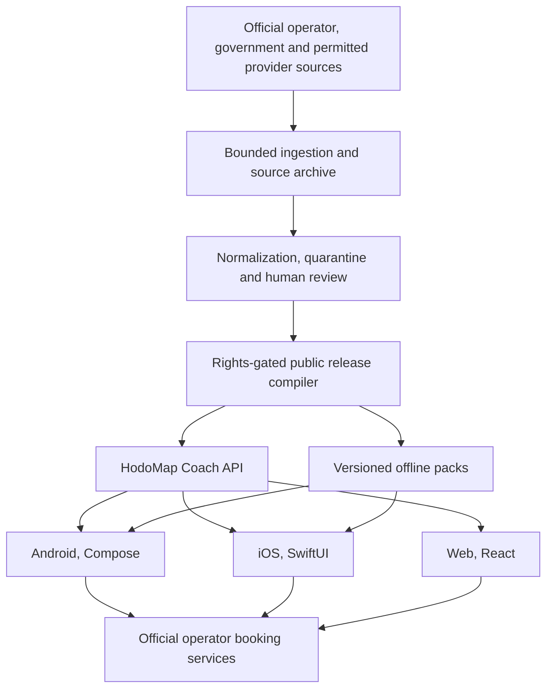

<div align="center">

# HodoMap

### Greece by bus, clearly.

Search intercity coach routes, timetables, stops and operators across Greece.
Understand what is verified, what is current and where to book officially.

[](#project-status)
[](#why-kotlin-multiplatform)
[](#platform-strategy)
[](LICENSE)

</div>

## What is HodoMap?

HodoMap brings Greece's fragmented intercity coach information into one
independent application. Travelers can search journeys, inspect stops and
route maps, save verified schedules for offline use and continue to each
operator's official booking service. When an operator does not sell
electronically, HodoMap provides its verified ticket-office and contact
information instead. Passengers can save trips, retain an explicitly imported
ticket securely on their device, and receive opt-in travel notifications.

The product is designed for residents and visitors, with Greek, English and
Albanian treated as first-class languages.

HodoMap does not pretend that unavailable data is complete. Every public
timetable is linked to its source, effective period, retrieval time and review
state.

HodoMap's differentiating product strategy is to become Greece's intercity
coach certainty layer: verify the date-specific journey, identify the exact
boarding point, provide an official purchase or contact action, and keep the
trip ready offline. See the
[product differentiation strategy](docs/PRODUCT_DIFFERENTIATION.md).

## Product principles

- **Evidence before coverage.** A missing journey is better than an invented
  journey.
- **One national search.** Operator boundaries should not become passenger
  complexity.
- **Offline where it matters.** Reviewed schedules and stop data should remain
  useful with poor connectivity.
- **Official booking handoff.** HodoMap informs and routes users to the
  operator. It does not issue tickets without written authority. Operators
  without electronic ticketing receive a verified contact and physical
  ticket-office fallback.
- **Passenger-owned travel wallet.** Saved trips and imported tickets remain
  local by default. Push services receive no ticket, barcode, passenger, or
  booking-reference data.
- **Visible freshness.** Users can see when information was checked and which
  source supports it.
- **Privacy by default.** Location and favorites stay on the device unless a
  future feature clearly requires otherwise.
- **Accessible to everyone.** Screen readers, dynamic text, keyboard
  navigation, contrast and reduced motion are release requirements.

## Should HodoMap use Kotlin Multiplatform?

**Yes, for the mobile core.**

Kotlin Multiplatform is a strong fit for the parts that must behave identically
on iOS and Android:

- Domain models and journey contracts.
- API and offline-pack clients.
- SQLDelight persistence.
- Favorites and recent searches.
- Coverage, freshness and rights states.
- Date, time-zone and calendar rules.
- Search coordination and result ordering.
- Localization keys and formatting contracts.

HodoMap should not become one enormous shared UI module.

## Platform strategy

| Platform | UI | Maps | Shared code |
|---|---|---|---|
| Android | Jetpack Compose | MapLibre or native map SDK | KMP mobile core |
| iOS | SwiftUI | MapKit | KMP mobile core |
| Web | TypeScript and React/Next.js | MapLibre GL JS | OpenAPI and JSON schemas |

The Web app stays web-native because public transport pages benefit from
search-engine indexing, semantic HTML, browser accessibility and the mature
JavaScript mapping ecosystem.

The API remains canonical for routes, calendars, source lineage and release
identity. Clients may cache reviewed data for offline use, but they do not
independently invent national timetable logic.

## Architecture



The data path uses separate ingestion and public databases. Candidate,
rights-pending and quarantined records never enter a public release. See
[Architecture](docs/ARCHITECTURE.md) and
[Data governance](docs/DATA_GOVERNANCE.md).

## Daily source monitoring

HodoMap includes a deployable Raspberry Pi acquisition service. Every day it
checks the 62 federation operator directory pages, the national directory and
the Greek NAP catalog using conditional, rate-limited requests.

The monitor:

- Retains only metadata and content digests when reuse rights are unknown.
- Stores source bodies only when rights are explicitly `permitted`.
- Discovers external official-site candidates without retaining page bodies.
- Queues changed sources for review.
- Rejects oversized and unexpected responses.
- Has a hard daily request budget.
- Keeps TicketWeb disabled until written terms approval.
- Never publishes a changed timetable automatically.

See the [daily acquisition runbook](ops/raspberry-pi/DAILY_ACQUISITION.md).

## Design language

HodoMap uses Aegean teal, limestone surfaces and sun amber to create a calm,
independent and trustworthy national travel product.

The complete [design system](docs/DESIGN_SYSTEM.md), machine-readable
[design tokens](design/tokens/hodomap.tokens.json) and
[visual brand board](design/HodoMap-Brand-Board.svg) define color, typography,
spacing, components, maps, dark mode, motion and accessibility.

## Repository layout

```text
HodoMap/
├── apps/
│   ├── android/          Android Compose application
│   ├── ios/              Native SwiftUI application
│   └── web/              React/Next.js public web application
├── shared/
│   ├── core/             KMP domain, network, database and common code
│   └── features/         Shared mobile feature logic
├── server/
│   ├── api/              Public API and administrative review service
│   ├── ingestion/        Source adapters and normalization jobs
│   ├── migrations/       Versioned database migrations
│   └── ktel-staging/     Transplanted compiler and API awaiting integration
├── data/
│   ├── schemas/          Public schemas and interchange contracts
│   └── fixtures/         Small lawful test fixtures
├── ops/
│   └── raspberry-pi/     Deployment, systemd, nginx, backup and monitoring
├── scripts/              Reproducible development and data commands
├── docs/                 Architecture, governance and roadmap
└── .github/              Contribution and automation configuration
```

Each top-level area has a README describing what belongs there and what must
not be committed.

The [documentation index](docs/INDEX.md) identifies the current plan,
architecture, design and preserved earlier analysis.

## Data trust model

Every source and normalized entity carries:

- Operator and source identity.
- Retrieval time and effective period.
- Content digest.
- Rights state.
- Review state.
- Parser version.
- Public release identity.

Only records marked `permitted` and `approved` can be compiled for public use.
Raw booking-system responses, credentials, passenger information and
rights-pending datasets are not repository content.

Read the complete rules in [DATA_GOVERNANCE.md](docs/DATA_GOVERNANCE.md).

## Project status

HodoMap is currently in the **foundation and source-acquisition phase**.

The repository structure and product architecture are established. National
route and timetable coverage, the 19,872-source-stop normalization program,
exact road geometry, production Raspberry Pi deployment and client
applications are not yet complete.

The first release sequence is:

1. Establish legal and source authority.
2. Complete a three-operator vertical pilot.
3. Scale lawful adapters and stop normalization.
4. Deploy an isolated Raspberry Pi staging service.
5. Build iOS, Android and Web clients against one API contract.
6. Launch a transparent national beta.

See the detailed [roadmap](docs/ROADMAP.md).
The complete R0 to R6 delivery program is in the
[national execution plan](docs/NATIONAL_EXECUTION_PLAN.md).

## Development

The repository is intentionally architecture-first and does not yet contain a
generated Gradle, Xcode, Next.js or Python project. Toolchain versions and
dependency choices will be locked in the first implementation change instead
of committing disposable scaffolding.

Expected toolchains:

- JDK 17 or newer.
- Kotlin and Kotlin Multiplatform.
- Android Studio and Xcode.
- Node.js LTS for the Web app.
- Python 3.12 or newer for ingestion and API services.
- SQLite for source review and compiled public releases.

## Contributing

Start with [CONTRIBUTING.md](CONTRIBUTING.md). Changes to timetable logic,
source adapters, entity matching or public data require fixtures and evidence.

Security issues should follow [SECURITY.md](SECURITY.md), not a public issue.

## License and independence

HodoMap source code is licensed under the
[Apache License 2.0](LICENSE).

That license does not grant rights to third-party timetables, maps, operator
logos, trademarks or booking-system data. Dataset publication follows each
source's recorded terms and the rules in
[DATA_GOVERNANCE.md](docs/DATA_GOVERNANCE.md).

HodoMap is an independent project. It is not affiliated with, endorsed by or
operated by the KTEL federation, regional KTEL operators, TicketWeb or their
technology providers. Operator names and trademarks remain the property of
their respective owners.
