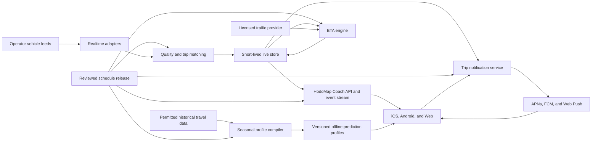

# Live Coach Map and ETA Product Analysis

Status: product and architecture proposal

Prepared: 30 July 2026

Scope: coach selection on the map, route origin and destination, intermediate
stops, vehicle movement, speed, traffic, predicted arrivals, online refresh,
offline behavior, data contracts, trust states, and phased delivery.

## 1. Product decision

HodoMap should support a tappable coach experience, but the UI must distinguish
four data layers:

1. **Scheduled:** the published journey, ordered stops, planned times, and
   reviewed route geometry.
2. **Offline predicted:** an approximate coach position and ETA calculated
   from the timetable plus downloaded historical and seasonal traffic profiles.
3. **Online traffic estimate:** an approximate coach position and ETA refined
   with current road traffic, without claiming a real vehicle observation.
4. **Live coach:** a fresh operator-authorized vehicle position matched to a
   specific journey, with live or calculated stop predictions.

These layers answer different questions. A traffic provider can estimate road
conditions. It cannot identify a particular KTEL coach, prove that it departed,
or report its current position. Those capabilities require a vehicle feed from
the operator, its telematics provider, or another explicitly authorized source.

The passenger-facing rule is simple:

> An estimated coach may move on the map, but it must never be labelled live.

When only a timetable and an offline traffic profile exist, HodoMap may show a
translucent predicted coach marker along the route. The marker must say
`Predicted from timetable`, show an uncertainty range, and state that departure
and current position are not confirmed.

## 2. Passenger questions the experience must answer

When a passenger taps a coach, the app should answer these questions in this
order:

1. Which journey is this?
2. Where did it start?
3. Where is it going?
4. Did it actually depart, or is the departure only scheduled?
5. Where is it now?
6. Which stop is next?
7. Which intermediate stops remain?
8. When is it expected at my stop and at the final destination?
9. Is it early, on time, or delayed?
10. How much time remains until the final destination?
11. What is the approximate average speed for the remaining route under
    current traffic?
12. How fresh and trustworthy is this information?
13. Where can I continue to the operator's official booking service?

The primary speed value should be the approximate effective traffic speed for
the remaining road route, not the coach's momentary speed. The current vehicle
speed can remain optional secondary information when it comes directly from a
permitted vehicle feed.

## 3. Main map experience

### 3.1 Map modes

The map should have explicit modes rather than mixing every object at once:

| Mode | Default content | Optional content |
|---|---|---|
| Journeys | Selected journey geometry and stops | Other search results |
| Coaches | Live and clearly differentiated estimated positions | Route and next stops |
| Nearby stops | Stops around the user | Next scheduled or predicted arrivals |
| Traffic | Selected route with traffic conditions | Incidents, when licensed |

On mobile, `Journeys`, `Coaches`, and `Stops` can be segmented controls above
the map. Within `Coaches`, filter chips can select `All`, `Live`, or
`Estimated`. Traffic should be a layer toggle because it modifies a selected
route rather than representing a separate passenger task.

The app should remember the selected mode only for the current session. Opening
a journey from search results should always select that journey and fit its
route safely within the visible map area.

### 3.2 Coach markers

The map can contain observed and estimated coach markers. Their visual
treatment must make the difference immediately understandable.

Marker states:

| State | Map treatment | Passenger label |
|---|---|---|
| Fresh | Filled teal coach with direction indicator | `Live` |
| Fresh but unmatched | Neutral coach, no route progress | `Live position, journey not confirmed` |
| Aging | Teal outline with refresh clock | `Updated 2 min ago` |
| Stale | Gray marker, no movement animation | `Position may be outdated` |
| Online estimated | Amber translucent coach with dotted route halo | `Estimated with current traffic` |
| Offline predicted | Limestone translucent coach with clock badge | `Predicted from timetable and seasonal traffic` |
| Timetable only | Schematic journey indicator, not a precise point | `Scheduled journey, position unknown` |
| Invalid | Hidden from public map | No public label |

Recommended initial freshness thresholds:

- `fresh`: observation age from 0 to 30 seconds
- `aging`: more than 30 seconds and up to 2 minutes
- `stale`: more than 2 minutes and up to 5 minutes
- `expired`: more than 5 minutes, hidden from the public live layer

Thresholds must be configurable per provider. A provider that publishes every
60 seconds cannot be judged by a 15 second contract, but the UI must still show
the actual update time.

Marker movement can interpolate between two validated observations for visual
smoothness. Interpolation must stop at the latest known point. It must never
continue predicting movement after the feed stops.

An estimated marker follows the prediction model instead of live
interpolation. It should move only when the model produces a new stable
progress estimate. Its uncertainty should appear as a highlighted interval of
the route, such as `likely between Stop A and Stop B`, rather than suggesting
meter-level precision.

At low zoom levels, coach markers should cluster. A cluster must keep live and
estimated counts separate, such as `3 live, 5 estimated`.

### 3.3 Selected route

Selecting a coach should show:

- The reviewed journey-pattern geometry.
- The completed part of the journey in a muted color.
- The remaining part in Route Teal.
- The next stop with a larger pulse-free highlight.
- Origin and destination as terminal markers.
- Intermediate stops that belong to this exact route variant.
- Traffic conditions only when the traffic layer is enabled.

The existing geometry rule remains: an ordered stop list is not an exact road
shape. If only ordered stops are reviewed, the UI may show the stops and a
clearly labelled schematic connection. It must not claim an exact driven path.

## 4. Tapping a coach

Tapping a marker opens a compact bottom sheet. Dragging or selecting `Journey
details` expands it into the complete route and arrival view.

### 4.1 Compact sheet

Recommended information order:

```text
LIVE • Updated 18 sec ago

KTEL Kavala
Kavala -> Thessaloniki

Next: Nea Peramos
Expected 14:42 • 7 min late

Started 13:05 from Kavala
1 h 43 min remaining
Thessaloniki expected 16:18

Traffic: about 58 km/h average
Adds approximately 13 min

[Follow this coach]      [Journey details]
```

If actual departure is not known:

```text
Scheduled to depart 13:05
Departure not confirmed
```

If there is no live position:

```text
Live position unavailable
Estimated position based on timetable and current traffic
Departure not confirmed
```

When offline:

```text
PREDICTED OFFLINE

Likely between Nea Peramos and Eleftheroupoli
1 h 50 min to Thessaloniki
Expected between 16:15 and 16:30

Based on timetable and Christmas traffic profile
No current traffic or confirmed coach position
```

The source and freshness row is always visible. It should not be hidden inside
an information menu.

### 4.2 Expanded journey sheet

The expanded sheet should include:

1. Operator, route name, and direction.
2. Live, online estimated, offline predicted, or timetable-only status.
3. Actual or scheduled origin departure.
4. Next stop and predicted arrival.
5. Final destination and predicted arrival.
6. Estimated time remaining.
7. Approximate average traffic speed for the remaining road route.
8. Delay relative to the published schedule.
9. Complete stop timeline.
10. Service alerts and traffic impact.
11. Optional live details, including momentary vehicle speed when allowed.
12. Source, update time, confidence, and known limitations.
13. Official booking or operator contact handoff.

The route name must include the variant where relevant, such as `via Peramos`
or `Express`. Origin and destination alone are not enough to identify the
journey pattern.

## 5. Intermediate stops

Every reviewed stop in the exact journey pattern should appear in a vertical
timeline.

Stop states:

| State | Visual | Timing |
|---|---|---|
| Passed | Check mark and muted label | Actual time if known |
| Current | Filled marker | `At stop` or `Departing` |
| Next | Strong outline | Predicted arrival |
| Upcoming | Standard marker | Predicted or scheduled time |
| Skipped | Strike or alert icon | `Will not stop` |
| Request stop | Hand or request icon | `Stop on request` |
| Unknown timing | Standard marker | `Time unavailable` |

Each stop row can expand to show:

- Scheduled arrival and departure.
- Predicted arrival and departure.
- Pickup and drop-off permission.
- Platform or bay, when operator-supplied.
- Stop facilities and accessibility, when reviewed.
- Source freshness.
- `View stop` action.

The app should never infer that a coach will serve a stop merely because the
road passes nearby. The stop must belong to the matched journey pattern or to
an authorized real-time trip modification.

## 6. Stop detail and the question "when will the KTEL arrive?"

A passenger may begin from a stop rather than from a coach. The stop screen
should therefore contain a `Next arrivals` panel.

Example:

```text
Nea Peramos

14:42  Thessaloniki     7 min late     Live
15:20  Kavala           Scheduled      Verified
16:05  Thessaloniki     Time uncertain Limited live data
```

Each arrival row must identify its time kind:

- `Live`: operator-supplied stop prediction.
- `Calculated`: HodoMap estimate from a fresh coach position and reviewed path.
- `Traffic estimate`: road-traffic estimate without a known coach position.
- `Scheduled`: published timetable only.
- `Time uncertain`: insufficient or stale evidence.

The primary text should say `Expected 14:42`, not `Arrives 14:42`, unless the
coach has already arrived and an actual event exists.

For low-confidence predictions, show a range such as `14:40 to 14:47`. False
minute-level precision is worse than an honest range.

## 7. Time vocabulary and truth rules

HodoMap needs a small, strict vocabulary:

| Value | Meaning |
|---|---|
| Scheduled | Published timetable value |
| Expected | Current prediction with a named method |
| Actual | Observed arrival or departure event |
| Delay | Expected or actual time minus scheduled time |
| On time | Real-time evidence is within the configured tolerance |
| No live data | No fresh prediction exists |

Important rules:

- Absence of a real-time update does not mean the coach is on time.
- A scheduled departure does not prove that the journey began.
- A GPS point near the origin does not prove departure until movement, a
  departure event, or an operator state supports it.
- A vehicle position without a reliable trip match must not inherit a route,
  destination, or stop list.
- A traffic estimate must be labelled as traffic-based, not live coach data.
- An empty result must preserve the current `unknown` semantics and must not
  become `confirmed no service`.

## 8. Traffic speed, time remaining, and final destination

The passenger-facing traffic summary should prioritize:

1. `1 h 43 min remaining`
2. `Expected in Thessaloniki at 16:18`
3. `Traffic adds approximately 13 min`
4. `About 58 km/h average for the remaining road route`

The speed value is an approximate effective average for the remaining route
under current traffic conditions. It is not the coach's speedometer reading,
the road speed limit, or a claim that the coach will maintain that speed.

When a traffic provider supplies remaining distance and traffic-aware road
duration, HodoMap can derive:

```text
estimated average traffic speed =
remaining road distance / traffic-aware road duration
```

For example, 93 remaining road kilometers with a traffic-aware road duration
of 1 hour 36 minutes gives an approximate effective average of 58 km/h.

The value should be rounded to a passenger-friendly level, normally the nearest
5 km/h. It should not change on screen for insignificant fluctuations.

### 8.1 Remaining journey time

The complete remaining journey time is not always identical to the traffic
provider's road duration. HodoMap must add or reconcile:

- Remaining stop dwell time.
- Scheduled or known driver breaks.
- Ferry boarding, sailing, and unloading segments.
- Operator-supplied stop predictions.
- Route deviations and service alerts.

The result shown as `1 h 43 min remaining` must therefore identify whether it
is:

- `Live`: based on a fresh matched coach position and operator prediction.
- `Calculated`: based on a fresh matched position plus route and traffic.
- `Traffic estimate`: based on route traffic without a known coach position.
- `Scheduled`: no current traffic or vehicle evidence.

If no coach position or confirmed progress exists, but the timetable and
offline profile indicate that the journey would probably be active, HodoMap
may show:

```text
Estimated 1 h 50 min remaining
Expected destination: 16:15 to 16:30
Based on timetable and Christmas traffic profile
Departure and coach position not confirmed
```

For a future journey, or when the current time is outside the plausible active
window, use `Estimated journey duration`. Use unqualified `Time remaining` only
after departure or route progress is observed. Otherwise use
`Estimated time remaining`.

### 8.2 Final destination ETA

The final destination card should always name the place:

```text
Final destination
Thessaloniki
Expected 16:18
1 h 43 min remaining
```

If the estimate is uncertain:

```text
Expected between 16:15 and 16:25
Traffic estimate, coach position unavailable
```

The final ETA should update when traffic changes materially, a new vehicle
position arrives, the coach passes a stop, or an operator prediction changes.
Minor changes should be stabilized to prevent the displayed time from jumping
back and forth every few seconds.

### 8.3 Traffic provider limitations

Some providers expose traffic only as categories such as normal, slow, or
traffic jam. If a provider does not return a numerical traffic-aware duration,
HodoMap must not invent a numerical average speed. In that case, show:

```text
Traffic: slow on parts of the route
Estimated destination time unavailable
```

### 8.4 Optional momentary coach speed

Momentary coach speed can be shown only under a strict source rule and as
secondary information.

Show `Current speed 72 km/h` only when:

- The permitted vehicle feed supplies a recent measured speed.
- The observation passes validation.
- The provider agreement permits public display.
- The timestamp is visible.

Do not calculate a public speed from two widely spaced GPS points and present
it as a vehicle measurement. Such calculations are noisy around tunnels,
mountain roads, ferry segments, GPS drift, and delayed feed delivery.

If HodoMap later derives speed for ETA processing, keep it internal and label
the passenger value `Estimated movement` rather than `Current speed`.

Speed is not a safety judgment. The UI must never say `speeding`, `unsafe`, or
similar without road-limit data, vehicle-class rules, validated telemetry, and
explicit legal authority.

## 9. Traffic layer

### 9.1 What traffic can add

A licensed traffic provider can support:

- Traffic-aware remaining duration.
- Approximate effective average speed for the remaining road route.
- Expected completion time and final destination ETA.
- Congestion categories along route segments.
- A comparison between normal duration and current expected duration.
- Traffic incident context when the license permits display.
- Better arrival estimates when combined with a fresh vehicle position.

The traffic layer can color the selected reviewed route:

- Route Teal: normal flow.
- Sun Amber: slower than normal.
- Red: severe congestion.
- Gray: no traffic observation.

Color must be accompanied by accessible labels in the sheet and route
timeline. The map cannot be the only place where delay information appears.

### 9.2 What traffic cannot add

Traffic alone cannot prove:

- Which physical coach is operating a trip.
- Whether a departure occurred.
- The current coach location.
- Time spent boarding passengers.
- Driver breaks.
- Ferry loading and sailing time.
- Operator-specific route deviations.
- An unscheduled cancellation.

A traffic-aware road duration between Kavala and Thessaloniki is not the same
as the expected arrival of the 13:05 KTEL journey.

### 9.3 Provider strategy

HodoMap should define a backend `TrafficProvider` contract and postpone a
permanent provider choice until coverage, cost, display rights, attribution,
retention, and platform consistency are tested in Greece.

The current platform choices create an important constraint:

- iOS uses MapKit.
- Android uses MapLibre or a native map SDK.
- Web uses MapLibre GL JS.

A MapKit-only ETA would not create identical behavior on Android and Web.
National ETA logic should therefore be produced by the HodoMap backend when
consistent cross-platform results matter. Native map traffic may still be used
as a visual enhancement if its license and labels are compatible.

Google's current Routes API documentation describes traffic-aware durations
and route intervals classified as normal, slow, or traffic jam. Apple's MapKit
documentation describes expected travel time that accounts for traffic.
Neither capability identifies a KTEL vehicle. Both require provider-specific
commercial, privacy, attribution, caching, and EEA terms review before product
selection.

The reviewed HodoMap geometry remains the route identity. A traffic provider
must not silently replace it with a different driving route. Traffic
calculations should follow the remaining reviewed path or reviewed waypoints.

## 10. ETA hierarchy

HodoMap should select the best available ETA method in this order:

1. **Operator prediction:** authorized stop-level arrival predictions.
2. **Live HodoMap calculation:** fresh matched vehicle position, reviewed
   geometry, remaining stops, dwell model, and current traffic.
3. **Live position without traffic:** fresh matched position, geometry,
   scheduled timing anchors, and recent progress.
4. **Online estimated:** scheduled trip plus current traffic, but no vehicle
   observation.
5. **Offline predicted:** scheduled trip plus downloaded seasonal traffic and
   dwell profiles.
6. **Schedule only:** published timetable without a matching prediction
   profile.
7. **Unknown:** insufficient trustworthy data.

The response and UI must include the selected method. Clients should not
reverse-engineer it from whichever fields happen to be present.

### 10.1 Live calculation outline

For a matched active coach:

1. Validate observation age, coordinate range, speed, and timestamp.
2. Match the coach to a published trip instance.
3. Snap the position to the reviewed route with a maximum allowed distance.
4. Preserve monotonic progress unless a route deviation is confirmed.
5. Determine the next stop from route progress and real-time stop status.
6. Request traffic duration along the remaining road path where supported.
7. Derive the approximate effective traffic speed from remaining road distance
   and traffic-aware road duration when both values are trustworthy.
8. Add expected dwell time at intermediate stops.
9. Handle ferry, rest, and known service segments separately.
10. Reconcile the result with operator predictions when present.
11. Produce the remaining journey time, final destination ETA, confidence
    range, and method.

Raw current speed must not be extrapolated across the entire remaining route.

### 10.2 Confidence

Recommended public confidence states:

| Confidence | Conditions | UI |
|---|---|---|
| High | Fresh operator stop prediction | Exact expected time |
| Medium | Fresh matched position plus reviewed geometry | Exact time plus `Calculated` |
| Low | Online estimate without position or aging live position | Time range |
| Predictive | Offline seasonal profile with sufficient historical samples | Wider time and route-position range |
| Unknown | Stale, unmatched, or incomplete data | Scheduled time or `Time unavailable` |

The system can store a numeric uncertainty in seconds, but passenger copy
should use clear labels and time ranges.

## 11. Online refresh behavior

### 11.1 Foreground

When the live map is open:

- Fetch a bounded viewport snapshot first.
- Subscribe to server-sent events for changes in that viewport.
- Update selected coach details when its version changes.
- Recalculate traffic at a much lower frequency than vehicle positions.
- Pause rendering work when the map screen is not visible.

Server-sent events are a good first choice because the client only needs a
one-way stream. WebSockets are justified later if the product adds
bidirectional dispatch or operational tools.

Suggested starting intervals:

| Data | Suggested frequency |
|---|---:|
| Operator vehicle feed ingest | Provider cadence, commonly 10 to 30 seconds |
| Public selected vehicle update | On change, capped at once per 5 seconds |
| Unselected viewport vehicles | 15 to 30 seconds |
| Stop predictions | 15 to 30 seconds |
| Traffic calculation | 2 to 5 minutes, or on meaningful progress |
| Service alerts | 1 to 5 minutes |

These are product defaults, not claims about any current KTEL feed.

### 11.2 Background and battery

- Stop continuous map updates when the app enters the background.
- Use platform notifications only for explicitly followed journeys.
- Resume with a fresh snapshot before applying stream events.
- Avoid high-accuracy user location unless a nearby-stop feature is active.
- Do not upload user location to follow a coach.

### 11.3 Offline

Offline mode can show:

- The last reviewed route and stop list.
- The verified schedule in the installed offline pack.
- Approximate positions for journeys expected to be active now.
- Seasonal and holiday-adjusted journey durations.
- Predicted intermediate-stop and final-destination arrival ranges.
- Approximate historical average speed for the selected route and time profile.
- The last live observation with its exact age and `Outdated` label.

Offline mode cannot show:

- Current traffic.
- A confirmed current delay.
- A confirmed departure, cancellation, deviation, or stop passage.
- Fresh stop predictions.

The live marker should disappear after its expiration threshold. If a matching
offline model exists, it can be replaced by a visually different predicted
marker. A stale last point can remain inside journey details for context, but
it must not be used as a current position.

### 11.4 Offline seasonal prediction model

Every offline pack can include compact, versioned travel-time profiles for
reviewed route segments. The profiles should be aggregated before
distribution, not a collection of raw historical vehicle tracks.

Useful profile dimensions:

- Operator and journey pattern.
- Direction.
- Route segment between reviewed stops.
- Weekday, Saturday, Sunday, and public holiday.
- Departure-time bucket, such as 06:00 to 09:00.
- Month or travel season.
- Named seasonal period, such as Christmas, Easter, or summer.
- Outbound and return travel direction.
- Typical dwell time at intermediate stops.
- Median, slower-case, and upper-range travel duration.
- Historical sample count and last model update.

The Christmas profile should not be a single national multiplier. Traffic
before Christmas, on the public holidays, and during the return period can
affect different roads, directions, and departure times differently.

Offline calculation:

1. Find journeys whose reviewed timetable says they could be active at the
   device's current Europe/Athens date and time.
2. Select the most specific available profile for route, direction, date type,
   season, and departure-time bucket.
3. Fall back from a named holiday profile to seasonal, weekend or weekday, and
   finally normal timetable timing when data is insufficient.
4. Apply predicted segment and stop dwell durations.
5. Estimate how far the journey would probably have progressed since scheduled
   departure.
6. Place a translucent marker at the center of the probable route interval.
7. Highlight the wider probable interval between stops.
8. Calculate remaining duration, destination ETA, and a confidence range.
9. State that departure and current position are not confirmed.

Example:

```text
Predicted offline
Likely between Stop 4 and Stop 5
Historical Christmas traffic: heavy
Approximate route average: 48 km/h
Expected destination: 16:15 to 16:30
Model updated 1 December 2026
```

The model cannot know about a current crash, weather event, road closure,
unscheduled stop, cancellation, or unusually fast journey while offline.
`Calculate correctly` therefore means calibrated prediction with a measured
error range, not guaranteed real-time accuracy.

The offline pack should include:

```text
trafficProfileVersion
modelVersion
generatedAt
validFrom
validUntil
sourceAttribution
routeSegmentProfiles[]
holidayCalendar[]
fallbackRules
```

Offline redistribution and caching must be allowed by every contributing data
source. If a commercial traffic provider forbids offline derived profiles,
HodoMap needs operator-owned data, lawfully reusable public data, or its own
permitted aggregated observations.

## 12. Realtime source standards

HodoMap should accept provider adapters, not force every operator to publish
the same format immediately.

Preferred input order:

1. GTFS Realtime Vehicle Positions, Trip Updates, and Service Alerts.
2. SIRI Vehicle Monitoring and Estimated Timetable feeds.
3. Documented operator or telematics-provider APIs.
4. Contractual webhook or message streams normalized by an adapter.

GTFS Realtime already models vehicle position, trip identity, stop sequence,
next-stop status, observation timestamp, bearing, speed, congestion, occupancy,
stop predictions, cancellations, and alerts. Fields are optional, so HodoMap
must still report field-level availability.

Screen scraping an undocumented live map is not an acceptable production
source. A technically visible endpoint does not establish permission,
reliability, support, or redistribution rights.

As of 30 July 2026, this repository contains no authorized national live KTEL
vehicle feed. The prior platform analysis also records that no private,
documented, or contractual live feed had been obtained. The Greek NAP endpoint
could not be newly verified in this analysis because its TLS certificate
failed local validation. This is not proof that live KTEL data does not exist.
It means HodoMap must establish availability operator by operator and record
the evidence.

## 13. Proposed public API

Live data should remain separate from immutable schedule releases.

### 13.1 Snapshot endpoints

```text
GET /api/v1/coaches/live/vehicles
GET /api/v1/coaches/live/vehicles/{publicVehicleId}
GET /api/v1/coaches/trips/{tripId}/realtime
GET /api/v1/coaches/stops/{stopId}/arrivals
GET /api/v1/coaches/routes/{patternId}/traffic
GET /api/v1/coaches/service-alerts
```

`GET /live/vehicles` should require a bounded viewport, route, operator, or
trip filter. It must not become an unbounded national history export.

Useful parameters:

```text
bbox=minLon,minLat,maxLon,maxLat
operatorId=
patternId=
tripId=
updatedSince=
limit=
```

### 13.2 Stream endpoint

```text
GET /api/v1/coaches/live/stream?bbox=...&operatorId=...
Accept: text/event-stream
```

Event types:

- `vehicle.upsert`
- `vehicle.expired`
- `trip.prediction`
- `service.alert`
- `coverage.changed`

Every event should include a monotonically increasing stream cursor so clients
can detect gaps and request a new snapshot.

### 13.3 Vehicle response

Suggested shape:

```json
{
  "publicVehicleId": "live_kav_8f31",
  "operatorId": "ktel-kavala",
  "tripId": "trip_20260730_1305_kav_thes",
  "patternId": "pattern_kav_thes_via_peramos",
  "position": {
    "latitude": 40.8612,
    "longitude": 24.3165,
    "bearingDegrees": 251,
    "speedKph": 67
  },
  "observedAt": "2026-07-30T14:35:18+03:00",
  "receivedAt": "2026-07-30T14:35:21+03:00",
  "freshnessState": "fresh",
  "matchState": "matched",
  "currentStopSequence": 3,
  "vehicleStopStatus": "in_transit_to",
  "nextStopId": "stop_nea_peramos",
  "sourceId": "source_operator_live_kav",
  "displayRights": {
    "position": true,
    "speed": true
  }
}
```

The public ID should be stable during the active journey and rotate later. Do
not publish a license plate, driver identity, internal fleet identifier, or
long-term movement history by default.

### 13.4 Trip realtime response

Suggested core fields:

```json
{
  "tripId": "trip_20260730_1305_kav_thes",
  "serviceState": "active",
  "realtimeState": "live",
  "departure": {
    "scheduledAt": "2026-07-30T13:05:00+03:00",
    "actualAt": "2026-07-30T13:08:10+03:00"
  },
  "nextStop": {
    "stopId": "stop_nea_peramos",
    "scheduledAt": "2026-07-30T14:35:00+03:00",
    "expectedAt": "2026-07-30T14:42:00+03:00",
    "predictionMethod": "operator_trip_update",
    "uncertaintySeconds": 60
  },
  "destination": {
    "stopId": "stop_thessaloniki",
    "scheduledAt": "2026-07-30T16:05:00+03:00",
    "expectedAt": "2026-07-30T16:18:00+03:00"
  },
  "delaySeconds": 780,
  "trafficImpactSeconds": 420,
  "remainingDistanceMeters": 93000,
  "trafficRoadTimeSeconds": 5760,
  "journeyRemainingSeconds": 6180,
  "estimatedAverageTrafficSpeedKph": 58,
  "expectedDestinationAt": "2026-07-30T16:18:00+03:00",
  "observedAt": "2026-07-30T14:35:18+03:00",
  "expiresAt": "2026-07-30T14:40:18+03:00",
  "sourceId": "source_operator_live_kav"
}
```

`trafficImpactSeconds` is optional and must not be populated by subtracting two
unrelated provider routes. It requires a documented comparable baseline.

`estimatedAverageTrafficSpeedKph` describes the remaining route under current
traffic. It must not reuse the vehicle observation's optional `speedKph`.
`trafficRoadTimeSeconds` covers road movement. `journeyRemainingSeconds` may
also include stops, breaks, ferry segments, and other reviewed journey time.

### 13.5 Notification subscriptions

Push subscriptions belong to a separate authenticated notification service,
not the immutable read-only timetable API.

```text
POST   /api/v1/notifications/subscriptions
PATCH  /api/v1/notifications/subscriptions/{subscriptionId}
DELETE /api/v1/notifications/subscriptions/{subscriptionId}
```

Suggested request:

```json
{
  "installationId": "opaque_device_installation",
  "tripId": "trip_20260730_1305_kav_thes",
  "events": [
    "departure_reminder",
    "material_delay",
    "cancellation",
    "stop_change",
    "selected_stop_approaching"
  ],
  "delayThresholdSeconds": 600,
  "selectedStopId": "stop_thessaloniki"
}
```

The service stores the APNs, FCM, or Web Push destination separately and
encrypted. The subscription contains no ticket artifact, barcode, passenger
name, payment data, booking reference, or exact user location. It expires after
the trip and can be deleted from `My trips`.

Local schedule and offline-prediction reminders require no server
subscription.

## 14. Server architecture

The immutable public timetable database and live observations have different
lifecycles and should remain separate.



Recommended boundaries:

- `ktel-public.db` remains the immutable reviewed schedule release.
- A separate `coach-live.db` or in-memory store contains current state.
- Provider adapters write observations through validation, never directly to
  the public API.
- The ETA engine reads reviewed geometry and schedules plus short-lived live
  state.
- The seasonal profile compiler creates compact, rights-cleared prediction
  profiles for offline packs.
- Clients calculate offline predicted progress and ETA from the immutable
  schedule plus the matching profile.
- The notification service observes public trip state and stores only opaque
  device subscriptions and event preferences.
- Clients receive public IDs and passenger-safe fields only.

For a three-operator pilot on Raspberry Pi, a separate SQLite live store with
WAL, bounded writes, and aggressive expiry may be sufficient. Before national
scale, load testing must determine whether an in-memory cache and a durable
event store are needed. Live GPS history must not be added to the immutable
offline packs.

## 15. Proposed live data model

The normalized model should add concepts similar to:

| Entity | Purpose |
|---|---|
| `realtime_sources` | Provider, rights, cadence, health, and ownership |
| `vehicle_observations` | Short-lived raw normalized observations |
| `active_vehicle_state` | Latest validated passenger-safe state |
| `trip_realtime_state` | Active, delayed, canceled, completed, or unknown |
| `stop_predictions` | Expected arrival and departure with method |
| `service_alerts` | Operator or provider disruptions |
| `traffic_snapshots` | Short-lived traffic result and attribution |
| `historical_traffic_profiles` | Aggregated segment timing by route, date type, season, and direction |
| `offline_prediction_state` | Client-calculated probable progress, ETA range, method, and confidence |
| `notification_subscriptions` | Opaque device, public trip, event rules, and automatic expiry |
| `realtime_quality_events` | Rejections, staleness, jumps, and match failures |

`saved_trips` and `saved_tickets` are client-local models by default. Ticket
artifacts must not enter the server ingestion, public release, realtime, or
notification databases.

Required fields across live entities:

- Source and operator identity.
- Provider observation time.
- HodoMap receipt time.
- Trip matching method and confidence.
- Public display rights by field.
- Expiration time.
- Quality state.
- Parser version.

Suggested retention:

- Latest public vehicle state: until five minutes after the last observation.
- Raw position observations: 24 hours or less for incident diagnosis, if the
  agreement permits retention.
- Aggregated feed health: longer retention without reconstructable vehicle
  tracks.
- User follow state: on-device by default.

The exact retention policy needs provider agreements, operational need, and a
privacy review.

## 16. Validation and failure shields

A position must be rejected or quarantined when it has:

- Coordinates outside valid WGS-84 ranges.
- A timestamp too far in the future.
- An observation age beyond the source contract.
- An impossible jump from the prior point.
- A physically implausible speed.
- A route distance beyond the configured map-match threshold.
- A trip identifier that conflicts with operator, date, or direction.
- Regressing route progress without a confirmed deviation or return pattern.

Starting pilot thresholds can flag:

- More than 500 meters from reviewed geometry.
- More than 140 km/h for an intercity coach observation.
- More than five minutes without an update.
- Arrival predictions earlier than a passed stop.
- Future timestamps more than 60 seconds ahead of the API clock.

These values are quarantine defaults, not legal speed limits or universal
truth. They require tuning with real pilot evidence.

Provider health should expose:

- Last successful poll or event.
- Last valid observation.
- Percentage of active trips matched.
- Median and high-percentile observation age.
- Rejected observation count by reason.
- Prediction error after actual arrivals become known.

If feed health falls below the public threshold, the API must degrade to
scheduled information automatically and explain that live data is unavailable.

## 17. Service alerts and followed journeys

Saving a journey should make HodoMap a travel companion before, during, and
after the trip. Push notifications must be useful, source-backed, configurable,
and limited to the saved journey.

### 17.1 Saved-trip actions

From a journey or coach bottom sheet:

- `Save trip`.
- `Follow this coach`.
- `Notify me before departure`.
- `Notify me if the ETA changes`.
- `Notify me before my stop`.
- `Share journey status` with a link that contains no user location or ticket.

A saved trip should contain:

- Operator and journey identity.
- Origin, destination, and intermediate stops.
- Service date and scheduled times.
- Observed, estimated, predicted, or schedule-only state.
- Official purchase and contact links.
- Saved ticket reference when the user imports one.
- Notification preferences.
- Offline pack and prediction-model version.

Saved trips use lifecycle states:

- `Planning`
- `Upcoming`
- `Active`
- `Completed`
- `Archived`

The app should move a trip between states automatically from its service date
and observed progress, while allowing the user to archive or delete it.

### 17.2 Travel notification types

Recommended notifications:

| Moment | Notification |
|---|---|
| After saving | `Trip saved. Ticket not added yet.` |
| Day before | Departure time, station, ticket status, and known alerts |
| Before leaving | Suggested time to leave for the station, when the user enables location-aware reminders |
| Before departure | `KTEL Kavala to Thessaloniki departs in 30 min` |
| Booking reminder | `You saved this trip but have not added a ticket` |
| Delay | Material delay and new expected time |
| Traffic | Material traffic impact with `Current` or `Historical prediction` label |
| Stop or platform change | New boarding location and source |
| Cancellation | Operator-confirmed cancellation and contact action |
| Boarding | Origin station, ticket action, and coach status |
| During journey | Next stop and expected arrival |
| Before selected stop | `Your stop is expected in 15 min` |
| Arrival | Destination, directions, and onward information |
| Offline data | `Update this trip before traveling for current information` |

Travel-readiness reminders can include only applicable, source-backed items:

- Ticket saved or ticket purchase link.
- Station name, address, and directions.
- Recommended arrival time when the operator publishes one.
- Identity-document requirement when officially stated.
- Luggage, bicycle, pet, or accessibility rules from the operator.
- Ferry or transfer segment.
- Ticket-office opening hours.
- Operator contact for assistance.

Do not send generic alarming reminders or invent operator requirements.

### 17.3 Online push and offline local notifications

When online, APNs, FCM, and Web Push can deliver:

- Operator service alerts.
- Live or online-estimated delay changes.
- Stop changes and cancellations.
- Traffic changes that materially affect the saved journey.
- Updated ticket-office or operator instructions.

When offline, the device can still schedule local notifications from:

- The saved timetable.
- The selected origin and destination.
- The downloaded holiday or seasonal prediction profile.
- User-selected reminder offsets.
- Locally stored ticket status.

Offline notification example:

```text
HodoMap prediction
Your saved journey is expected to depart in 45 minutes.
Christmas traffic may add 20 to 35 minutes.
Current traffic and departure are not confirmed while offline.
```

Offline notifications must never claim a current delay, cancellation, live
position, or platform change.

### 17.4 Notification controls

Notifications are opt-in per saved trip. Default settings should be modest:

- One day-before summary.
- One departure reminder.
- Material service alerts.
- One selected-stop reminder.

Users can enable or disable:

- Ticket reminders.
- Leave-for-station reminders.
- Delay threshold, such as 10, 20, or 30 minutes.
- Traffic prediction changes.
- Next-stop notifications.
- Arrival reminder.
- Offline-data freshness reminder.

Quiet hours apply except for a saved trip departing during that period or a
critical cancellation or stop change. Multiple changes within a short period
should collapse into one updated notification.

### 17.5 Source and confidence

Every notification should distinguish:

- `Operator alert`
- `Live`
- `Calculated with current traffic`
- `Predicted from historical Christmas traffic`
- `Scheduled reminder`
- `Source unavailable`

The notification timestamp and expected time must use the journey's local
timezone. An updated ETA should replace the prior pending notification rather
than producing a chain of contradictory alerts.

### 17.6 Notification privacy

The server needs only an opaque device subscription, public trip identifier,
and selected event rules. It does not need:

- The saved ticket file or barcode.
- Passenger name.
- Payment or booking reference.
- Exact user location.
- Contact list.

Location-aware `Leave now` reminders should be explicitly enabled. Prefer
on-device calculation using the user's current position and the station
coordinates. Do not retain location history.

Notifications expire automatically after the trip. Saved-trip deletion must
remove its server subscription and pending local notifications.

## 18. Official ticket purchase and operator contact

Every journey detail screen should finish with a useful passenger action. The
action depends on the operator's verified sales capability:

| Capability | Primary action | Secondary action |
|---|---|---|
| Verified journey deep link | `Buy from KTEL Kavala` | `Contact KTEL Kavala` |
| Verified operator store | `Open KTEL Kavala ticket store` | `Contact KTEL Kavala` |
| No electronic ticket | `How to buy this ticket` | `Contact KTEL Kavala` |
| Electronic ticketing unknown | `Check official ticket information` | `Contact KTEL Kavala` |
| Store temporarily unavailable | `Ticket store unavailable` | `Call ticket office` |

The button must name the operator and display an external-link symbol. Never
label it `Buy with HodoMap`, `HodoMap checkout`, or `Official HodoMap ticket`.

### 18.1 Map bottom sheet

Tapping a coach, predicted journey, route, or saved trip on the map opens a
HodoMap bottom sheet. HodoMap shows information and actions only. It does not
embed the operator's checkout.

Example:

```text
KTEL Kavala
Kavala -> Thessaloniki
Expected 16:18

[Save trip]  [Buy from KTEL Kavala]

Official store: ktelkavalas.gr
[Contact KTEL]  [Journey details]
```

After a ticket is saved:

```text
[View saved ticket]  [Trip details]
```

The bottom sheet remains part of the map experience. Tapping the purchase
button opens the official URL in the device's external default browser.

### 18.2 Verified online purchase flow

Preferred flow:

1. The passenger selects a journey.
2. HodoMap shows the official operator and the last verification date.
3. The passenger taps `Buy from KTEL <operator>`.
4. HodoMap opens the official operator store in the device's external default
   browser.
5. Origin, destination, service date, and journey can be prefilled only when
   the operator supports a verified deep-link contract.
6. The operator owns availability, passenger data, seat selection, payment,
   ticket delivery, refunds, and customer support.
7. The passenger can return to HodoMap without HodoMap reading the checkout or
   ticket.

Use the operating system's normal external URL action, such as Safari on iOS or
the user's selected browser on Android. Do not embed a checkout web view or
browser surface inside HodoMap.

The map bottom sheet can say:

```text
Buy from KTEL Kavala

You are continuing to the official KTEL Kavala ticket store.
KTEL Kavala manages availability, payment, tickets, changes, and refunds.

Official domain: ktelkavalas.gr
Link verified: 28 July 2026

[Open KTEL Kavala store]
```

The purchase button opens the browser with one tap. A second confirmation is
not required because the bottom sheet already names the external operator and
domain. If link safety has changed or cannot be verified, disable the purchase
action and show the contact fallback.

Purchase-link priority:

1. Verified journey-specific official deep link.
2. Verified origin and destination prefilled search link.
3. Verified operator ticket-store home page.
4. Verified official booking-information page.
5. Contact and physical ticket-office fallback.

A visible online store is not sufficient evidence for a reusable deep-link
template. Query parameters, redirects, supported dates, and mobile behavior
must be tested without completing a purchase.

### 18.3 Operators without electronic ticketing

When no electronic ticket is available, HodoMap should not leave a disabled
purchase button. Replace it with a complete `How to buy` card.

```text
Electronic tickets are not available for this KTEL

Buy at the station or contact KTEL Example:

Origin ticket office
Kavala Central Bus Station
Open today 06:00 to 21:00

[Call]  [Email]  [Directions]

Main operator office
Phone: +30 ...
Email: ...
Official website: ...

Information verified 12 days ago
```

The contact card should include every verified applicable field:

- Official operator name.
- Origin ticket office or agency.
- Destination office when useful.
- Main customer-service phone.
- Ticket-office phone.
- Official email.
- Official website.
- Physical address.
- Map coordinates and directions action.
- Opening hours and holiday exceptions.
- Supported communication channel, such as an official contact form.
- Accessibility contact or assistance instructions.
- Languages, only when confirmed.
- Last verified time and source.

If the operator does not publish a field, omit it or say `Not published`.
Never invent an email pattern, opening time, language, or WhatsApp number.

The most relevant contact comes first:

1. Origin station ticket office for this journey.
2. Operator reservation or ticket phone.
3. Operator customer-service contact.
4. Destination office.
5. General official website or federation directory.

### 18.4 Ask about this journey

The contact card can prepare a copyable message without sending it:

```text
Hello, I would like information about the following journey:
Kavala to Thessaloniki
30 July 2026 at 13:05
2 passengers

Can I reserve tickets, and where should I buy or collect them?
```

The passenger chooses whether to copy, email, or share the message. HodoMap
must not send a message or expose the passenger's information without an
explicit action.

Passenger count should be included only when the user enters it. Do not assume
adult, child, disability, student, or concession eligibility.

### 18.5 Offline behavior

Offline packs should retain the latest approved:

- Official store and booking-information URLs.
- Operator and ticket-office phones.
- Emails and official contact pages.
- Addresses, coordinates, and opening hours.
- Verification date and freshness state.

While offline:

- `Call` can use the device phone service.
- `Directions` can open an installed map with cached coordinates.
- `Email` can create a draft that the mail client may send later.
- `Copy details` remains available.
- `Open ticket store` explains that a network connection is required and can
  retry when connectivity returns.

Offline contact information must retain its verification date. If it is beyond
the allowed freshness window, show `Contact details may have changed`.

### 18.6 Booking and contact data contract

Journey and operator responses should expose:

```json
{
  "salesCapability": "verified_online_store",
  "purchase": {
    "operatorName": "KTEL Kavala",
    "officialUrl": "https://operator.example/booking",
    "linkKind": "journey_deep_link",
    "supportedParameters": [
      "origin",
      "destination",
      "serviceDate",
      "journey"
    ],
    "verifiedAt": "2026-07-28T10:00:00+03:00",
    "sourceId": "source_ktel_kavala_official"
  },
  "contacts": [
    {
      "kind": "origin_ticket_office",
      "name": "Kavala Central Bus Station",
      "phone": "+30...",
      "email": null,
      "address": "...",
      "openingHours": "06:00-21:00",
      "latitude": 40.0,
      "longitude": 24.0,
      "verifiedAt": "2026-07-28T10:00:00+03:00",
      "sourceId": "source_ktel_kavala_official"
    }
  ]
}
```

Recommended `salesCapability` states:

- `verified_journey_deep_link`
- `verified_online_store`
- `contact_or_office_only`
- `electronic_ticketing_unknown`
- `temporarily_unavailable`
- `not_currently_selling`

`contact_or_office_only` requires evidence that online sales are unavailable.
If the investigation is incomplete, use `electronic_ticketing_unknown`.

The normalized model should add:

| Entity | Purpose |
|---|---|
| `operator_sales_channels` | Official online store, phone, email, contact form, and verification |
| `ticket_offices` | Station or agency address, coordinates, hours, and supported sales |
| `journey_purchase_links` | Tested route or journey deep links and parameter contracts |
| `sales_channel_checks` | Dated verification result, redirects, device result, and reviewer |

### 18.7 Saving trips

`Save trip` should work before a ticket is purchased. Saved trips appear under
`My trips` and remain useful offline.

A saved trip contains:

- Journey, route variant, operator, origin, and destination.
- Service date, scheduled times, stops, and reviewed geometry.
- Latest source and timetable release identity.
- Offline normal, weekend, seasonal, or holiday prediction profile.
- Official purchase and contact links.
- Notification preferences.
- Optional relationship to a locally saved ticket.

The app should revalidate a saved trip when connectivity returns and clearly
show timetable changes, cancellations, stale data, or a changed purchase link.
It must not silently replace the journey the passenger originally saved.

Actions:

- `View on map`
- `Follow coach`
- `Buy ticket`
- `Add ticket`
- `Contact KTEL`
- `Download for offline`
- `Share trip`
- `Archive`
- `Delete`

Saved trips stay on the device by default. Account-based synchronization can be
a later explicit feature, with a separate privacy and encryption design.

### 18.8 Saving tickets

HodoMap may store a ticket for convenience without participating in the
purchase.

Supported user-controlled import paths:

1. The official store provides `Add to Apple Wallet` or `Add to Google Wallet`.
   HodoMap opens the official wallet action and links the saved trip to a local
   `Ticket in Wallet` status.
2. The passenger uses the browser or Files share sheet and selects
   `Save to HodoMap`.
3. The passenger imports an official PDF or image from Files or Photos.
4. The passenger manually records a booking reference and collection
   instructions when no digital ticket file exists.

Because purchase happens in an external browser, HodoMap cannot assume that a
ticket was purchased when the user returns. The saved trip should show:

```text
Did you receive a ticket?

[Add ticket]  [Ticket is in Wallet]  [Not now]
```

A saved ticket card can include:

- Operator.
- Origin and destination.
- Service date and departure.
- Passenger-entered label.
- Original PDF, image, or Wallet status.
- Barcode or QR code only from the original imported artifact.
- Booking reference when the passenger explicitly enters it.
- Collection or validation instructions from the official ticket.
- `Open original`, `Share`, `Export`, and `Delete`.

Storage rules:

- Ticket files remain on the device by default.
- Use platform file protection and encrypted application storage.
- Offer optional biometric protection for `My tickets`.
- Hide ticket previews in the operating-system app switcher.
- Never upload ticket files, barcodes, passenger names, or booking references
  to analytics, notification services, logs, or the HodoMap server.
- Exclude ticket files from unencrypted backups.
- Preserve the original artifact byte for byte.
- Do not redraw, regenerate, or modify an operator barcode.
- Allow the user to export and permanently delete the ticket.
- Mark tickets as upcoming, active, completed, or expired without deleting
  them automatically.

HodoMap should say:

```text
Saved copy
The KTEL operator remains the authority for ticket validity.
```

If a ticket is only a booking confirmation or requires station collection,
label that requirement prominently. Never call a confirmation email a valid
boarding ticket without evidence.

Local ticket model:

```text
savedTicketId
savedTripId
operatorId
artifactKind
localEncryptedPath
walletStatus
bookingReference
serviceDate
importedAt
passengerLabel
requiresCollection
```

Only non-sensitive trip and ticket-presence state should be available to the
notification scheduler. The ticket artifact, barcode, passenger label, and
booking reference remain inside the protected ticket store.

### 18.9 Safety and acceptance criteria

- Only `https` official or contractually approved booking URLs are public.
- Redirect chains are verified and monitored.
- A domain ownership change or unsafe redirect disables the purchase action.
- HodoMap never receives card, passenger, login, booking, or ticket data from
  the external checkout. A ticket enters HodoMap only through an explicit local
  import by the passenger.
- Prices appear only when source-backed and date-specific.
- A displayed price is not called final unless the operator guarantees it.
- Every supported operator has either a verified purchase path, a complete
  contact fallback, or an explicit `unknown` state.
- Phone, email, address, and hours have field-level source and verification
  dates.
- Deep links are tested on iOS, Android, and Web.
- Accessibility labels name the operator and state that the action opens an
  external service.
- Offline contact actions and stale-contact warnings are tested.
- Saved tickets open in airplane mode.
- Ticket files and barcodes never appear in logs, analytics, server requests,
  notification payloads, or app-switcher previews.
- Deleting a saved trip asks whether its linked local ticket should also be
  deleted.

## 19. Accessibility and localization

The live map must have a complete non-map equivalent.

Required behavior:

- A sortable live coach list accompanies the map.
- Every marker has an accessible route, destination, next stop, and freshness
  summary.
- Status uses text and icon as well as color.
- Dynamic Type and 200 percent browser zoom preserve the stop timeline.
- Screen readers announce meaningful updates, not every GPS movement.
- Reduced motion removes marker interpolation and pulsing.
- Map traffic colors meet contrast needs or have patterns and labels.
- Greek, English, and Albanian time and delay copy use locale-aware grammar.
- `Last updated` uses an absolute time when relative time could be ambiguous.

Example screen-reader summary:

```text
KTEL Kavala coach to Thessaloniki. Live position updated 18 seconds ago.
Next stop Nea Peramos, expected at 14:42, seven minutes late.
```

## 20. Privacy, security, and commercial controls

HodoMap should treat live coach movement as operational data.

Controls:

- Written authority for collection, processing, retention, and public display.
- Public pseudonymous vehicle IDs.
- No driver names, phone numbers, license plates, or internal fleet metadata.
- No public historical playback by default.
- Viewport and result limits on public endpoints.
- Per-source rate limits and circuit breakers.
- Signed provider requests or private network access where available.
- Secret storage outside the repository and client applications.
- Field-level display rights.
- Provider attribution and map attribution.
- A rapid source-disable and takedown control.

The user's location stays on device unless a future server feature explicitly
needs it. Nearby-stop search can submit a coarse viewport instead of a durable
user identifier.

## 21. Delivery sequence

### Phase A: truthful scheduled map

Deliver:

- Search result to journey detail.
- Reviewed route geometry.
- Origin, destination, and intermediate stop timeline.
- Scheduled times and source freshness.
- Stop detail with scheduled arrivals.
- Timetable-only journey indicators without a claimed current position.
- Map bottom sheet with `Save trip`, official-store link, and KTEL contact
  fallback.
- `My trips` with protected local ticket import.
- Scheduled departure, ticket, and travel-readiness local notifications.

Exit gate:

- A passenger can understand the complete reviewed journey offline.
- No scheduled value is labelled live.
- Official checkout always opens in the external browser.
- An imported ticket remains accessible in airplane mode and absent from
  server and analytics traffic.

### Phase B: offline seasonal prediction

Deliver:

- Versioned historical route-segment profiles.
- Weekday, weekend, holiday, Christmas, Easter, and summer selectors where
  sufficient evidence exists.
- Predicted offline coach markers with route-position intervals.
- Offline remaining duration and final destination ETA ranges.
- Clear `Predicted from timetable` labels.
- Model version, validity period, and source attribution in every pack.

Exit gate:

- Airplane-mode tests produce deterministic predictions.
- Missing holiday profiles fall back safely without invented precision.
- Estimated markers are visually distinct from live markers.
- Held-out journey tests report median and upper-range prediction error.
- The pack contains no prohibited raw traffic or vehicle history.

### Phase C: online traffic-enhanced experiment

Deliver:

- Provider evaluation for Greek intercity road coverage.
- Traffic-aware route duration for selected pilot routes.
- Approximate average traffic speed, remaining duration, and destination ETA.
- Route congestion layer.
- `Traffic estimate` labels and confidence ranges.
- Cost, caching, attribution, and EEA terms review.

Exit gate:

- The same test journeys produce explainable results on iOS, Android, and Web.
- The reviewed coach geometry is not silently replaced.
- Traffic estimates improve held-out arrival accuracy enough to justify cost.

### Phase D: one-operator live pilot

Deliver:

- Written provider or operator agreement.
- Vehicle adapter and trip crosswalk.
- Live marker, compact sheet, and expanded timeline.
- Stop predictions and feed health.
- Automatic fallback through online estimated, offline predicted, schedule-only,
  and unknown states.
- Opt-in live delay, cancellation, stop-change, and selected-stop push
  notifications.
- Synthetic and recorded replay tests.

Exit gate:

- At least 95 percent of accepted active observations match the correct trip
  during the pilot period.
- Median public observation age is below the provider contract.
- No expired coach remains visible as live.
- Prediction accuracy is measured at actual stops.

### Phase E: three-operator vertical pilot

Deliver:

- Three different real-time source formats or operational patterns.
- Service alerts.
- Followed journey notifications.
- Operational dashboard and source-disable controls.
- Load and battery tests.

Exit gate:

- Seven-day soak without incorrect cross-operator trip matches.
- Source outages degrade cleanly.
- Accessibility, localization, privacy, and retention reviews pass.

### Phase F: national expansion

Deliver only for operators with:

- Authorized source access.
- Reviewed trip crosswalks.
- Stable feed health.
- Measured prediction quality.
- An assigned owner and disable path.

National schedule, offline prediction, online estimate, and live coverage must
remain separate metrics. HodoMap can have excellent national schedules and
useful offline predictions while only a subset of operators support live
coaches.

## 22. Product analytics

Measure usefulness without storing unnecessary location history:

- Journey details opened.
- Coach markers selected.
- Stop arrivals opened.
- Follow actions started and expired.
- Percentage of live views that degrade to online estimated, offline predicted,
  or schedule-only states.
- Offline prediction error by normal day, weekend, holiday, and season.
- Percentage of predicted journeys with sufficient profile samples.
- Prediction error at 5, 15, 30, and 60 minutes before a stop.
- Feed age and availability per operator.
- Battery and data use during a 30-minute live session.
- Traffic-provider requests and cost per active journey.
- Official-store handoffs opened, without observing checkout behavior.
- Contact fallback call, email, copy, and directions actions.
- Percentage of operators with verified deep links, general stores, contact
  fallbacks, or unknown sales state.
- Accessibility task completion in map and list modes.

Do not optimize success around time spent watching a moving marker. The
successful outcome is that a passenger confidently knows where to wait and
when the coach is expected.

## 23. Recommended first implementation slice

The best first slice does not require a real KTEL feed:

1. Extend the synthetic fixture with one journey, eight stops, reviewed
   geometry, and scheduled stop times.
2. Add one synthetic operator with a verified journey purchase link and one
   contact-only operator with a ticket office, phone, email, address, and
   opening hours.
3. Add normal-weekday and Christmas offline profiles for every synthetic route
   segment.
4. Test the active-journey position, remaining duration, and ETA in airplane
   mode at fixed device times.
5. Test official-store handoff and offline contact fallback.
6. Build `My trips`, protected ticket import, Wallet status, export, and
   deletion.
7. Add scheduled local reminders and a synthetic push-notification service.
8. Verify that ticket contents never enter logs, analytics, API calls, or push
   payloads.
9. Add a synthetic real-time replay containing positions, a delay, a stop
   arrival, a stale interval, and recovery.
10. Implement the API response contracts behind a development-only adapter.
11. Build the tappable marker, bottom sheet, stop timeline, and all degraded
   states on one client.
12. Verify the same domain states in the KMP core.
13. Add a list alternative and accessibility labels.
14. Run the offline clock scenarios and live replay deterministically in tests.
15. Connect a real operator only after written access and field-level display
   rights exist.

This slice proves the product and architecture without pretending that
national live data is already available.

## 24. Required decisions before implementation

1. Which three operators are the scheduled-data pilot?
2. Does any pilot operator provide GTFS Realtime, SIRI, or a documented
   telematics API?
3. Which live fields may be displayed and how long may observations be stored?
4. Which traffic providers have acceptable Greek coverage and cross-platform
   terms?
5. Which permitted data can be used to build and redistribute offline normal,
   weekend, Christmas, Easter, and summer profiles?
6. Will the first client implementation be iOS, Android, or Web?
7. What prediction accuracy is good enough to show an exact minute instead of
   a range?
8. Is current speed useful enough to justify display, or should it remain in
   diagnostics for the pilot?
9. Which team or owner can disable an incorrect live source immediately?
10. Which official booking domains and deep-link parameters are verified for
    each pilot operator?
11. How frequently must booking links, phones, emails, addresses, and opening
    hours be reverified?
12. Which additional ticket artifact formats must the pilot support beyond
    platform Wallet status, PDF, and image import?
13. Which travel notifications are enabled by default, and which require
    additional location or background permissions?

## 25. Final recommendation

Build the UI contract now, using synthetic offline profiles and live replay
data. Design every screen to degrade from live to online estimated to offline
predicted to schedule-only to unknown.

Prioritize these passenger values:

1. Next stop.
2. Expected arrival.
3. Time remaining and final destination ETA.
4. Approximate average traffic speed.
5. Delay and confidence.
6. Remaining stops.
7. Freshness and source.
8. Observed or estimated position.
9. Optional momentary coach speed.

This ordering makes HodoMap useful even before national live feeds exist.
Offline users can still see a probable coach interval and holiday-adjusted ETA.
When operator-authorized telematics becomes available, the same interface can
replace the predicted marker with a real coach observation and improve the
arrival range without changing the product's trust model.

Every journey should finish with an actionable sales result: a verified
`Buy from KTEL <operator>` handoff, a complete `How to buy` and operator-contact
fallback, or an honest `Electronic ticketing unknown` state.

`Save trip` is a core action from the map and journey detail. A passenger can
then attach an original ticket locally, configure travel notifications, use the
journey offline, and follow its observed or predicted progress. Checkout stays
in the external browser, while trip planning, ticket convenience, and travel
readiness stay inside HodoMap.

## 26. Technical references

- [GTFS Realtime feed entities](https://gtfs.org/documentation/realtime/feed-entities/overview/)
- [GTFS Realtime reference](https://gtfs.org/documentation/realtime/reference/)
- [GTFS Realtime trip updates](https://gtfs.org/documentation/realtime/feed-entities/trip-updates/)
- [Google Routes traffic-aware polylines](https://developers.google.com/maps/documentation/routes/traffic_on_polylines)
- [Google Routes traffic preferences](https://developers.google.com/maps/documentation/routes/config_trade_offs)
- [Apple MapKit expected travel time](https://developer.apple.com/documentation/mapkit/mkdirections/etaresponse/expectedtraveltime)
- [Greek National Access Point long-distance bus catalog](https://data.nap.gov.gr/el/dataset/information-about-transport-by-long-distance-buses-in-greece)
